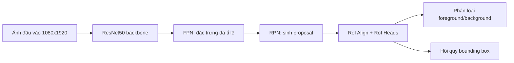
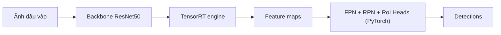

# SeaDronesSee ResNet50 Faster R-CNN Pipeline

## Demo

Video so sánh trực quan giữa hai nhánh:

- trái: `FP32 full PyTorch`
- phải: `INT8 hybrid` với backbone TensorRT

[Tải video demo](./video_fp32_full_vs_int8_hybrid_ve2.mp4)

## 1. Giới thiệu

Nhánh này triển khai bài toán phát hiện vật thể trên ảnh biển với kiến trúc Faster R-CNN sử dụng backbone ResNet50 kết hợp FPN. Mục tiêu của pipeline là xây dựng một baseline FP32 sạch, sau đó mở rộng sang Quantization-Aware Training (QAT) và triển khai tăng tốc theo hướng TensorRT cho riêng phần backbone.

Khác với nhánh cũ, pipeline hiện tại tập trung vào cấu hình ResNet50 với đầu vào độ phân giải cao `1080x1920`, đồng thời rút gọn bài toán phân loại về `2 class`: `background` và `foreground`. Tất cả đối tượng hợp lệ trong dữ liệu được gom về cùng một lớp foreground để ưu tiên khả năng phát hiện có-vật-thể trong bối cảnh vật thể rất nhỏ, mật độ thấp và nền biển có nhiều nhiễu.

## 2. Kiến trúc tổng thể

Mô hình hiện tại sử dụng kiến trúc Faster R-CNN hai giai đoạn. Ảnh đầu vào được đưa qua backbone ResNet50 để trích xuất đặc trưng không gian. Các đặc trưng ở nhiều mức sâu khác nhau được tổng hợp bởi Feature Pyramid Network (FPN) nhằm tạo ra biểu diễn đa tỉ lệ phù hợp với bài toán vật thể nhỏ. Sau đó, Region Proposal Network (RPN) sinh các vùng đề xuất, và RoI Heads thực hiện phân loại cuối cùng cùng với hồi quy hộp giới hạn.

Luồng xử lý có thể mô tả như sau:

## 3. Thiết kế backbone ResNet50-FPN

Backbone của mô hình là `ResNet50` pretrained, sau đó được gắn với FPN để tạo ra đặc trưng đa tỉ lệ. Trong cấu hình hiện tại:

- `backbone = resnet50`
- `trainable_backbone_layers = 5`
- `fpn_out_channels = 256`

Giá trị `trainable_backbone_layers = 5` có nghĩa là toàn bộ backbone ResNet50 được fine-tune, không đóng băng các stage chính. Đây là cấu hình full fine-tune của backbone, phù hợp khi dữ liệu đích khác đáng kể so với dữ liệu tiền huấn luyện.

FPN đóng vai trò quan trọng trong bài toán này vì vật thể trên mặt biển thường rất nhỏ so với khung hình. Nếu chỉ dùng đặc trưng sâu ở một mức duy nhất, nhiều chi tiết nhỏ sẽ bị mất. Việc tổng hợp đặc trưng theo nhiều scale giúp detector vừa giữ được chi tiết cục bộ, vừa có đủ ngữ cảnh để phân biệt vật thể với nền sóng, bọt nước và phản xạ ánh sáng.

## 4. Cấu hình đầu vào và anchor box

Pipeline hiện tại làm việc ở độ phân giải cao:

- `min_size = 1080`
- `train_min_sizes = [1080]`
- `max_size = 1920`

Đây là lựa chọn có chủ đích để giữ lại tối đa chi tiết của vật thể nhỏ. Trong các cảnh biển, đối tượng như người bơi, phao hay thiết bị cứu sinh có thể chỉ chiếm một vùng rất nhỏ của ảnh; nếu resize xuống quá thấp thì tín hiệu sẽ suy giảm mạnh.

Một điểm khác biệt quan trọng của nhánh này là anchor box không dùng bộ cố định mặc định. Thay vào đó, anchor được suy ra tự động từ thống kê bounding box của tập huấn luyện sau khi resize theo đúng cấu hình detector hiện tại. Với nhánh ResNet50 này, hệ thống đang sinh ra bộ anchor điển hình:

- `[9, 17, 29, 52, 118]`

Cách tiếp cận này giúp anchor bám sát phân bố kích thước vật thể thực tế trong dữ liệu hơn so với bộ anchor chuẩn kiểu `(32, 64, 128, 256, 512)`.

## 5. Thiết kế bài toán 2 class

Thay vì giữ nguyên toàn bộ lớp gốc của SeaDronesSee, pipeline hiện tại sử dụng:

- `background`
- `foreground`

Điều này được thực hiện thông qua cơ chế `binary_collapse_foreground`, trong đó mọi lớp vật thể hợp lệ đều được ánh xạ về cùng một nhãn foreground.

Mục đích của thiết kế này là giảm độ khó của đầu ra phân loại, để mô hình tập trung trước tiên vào câu hỏi quan trọng nhất: vùng nào thực sự chứa vật thể. Đây là hướng phù hợp khi mục tiêu chính là phát hiện mục tiêu nhỏ trong môi trường nền phức tạp. Tuy nhiên, cách gom lớp này cũng có nhược điểm: mô hình dễ học theo kiểu “có gì đó giống vật thể” mà không cần phân biệt loại vật thể, nên nếu chưa được huấn luyện đủ ổn định thì false positive có thể tăng.

## 6. RPN và cơ chế sinh proposal

RPN hoạt động trên đặc trưng FPN để sinh các vùng ứng viên. Ở nhánh hiện tại, các proposal được giữ tương đối nhiều để ưu tiên recall cho vật thể nhỏ. Cấu hình chính gồm:

- `rpn_pre_nms_top_n_train = 2000`
- `rpn_pre_nms_top_n_test = 1000`
- `rpn_post_nms_top_n_test = 1000`

Thiết kế này giúp hạn chế việc bỏ sót vật thể nhỏ ở giai đoạn đầu, nhưng đồng thời cũng làm tăng số proposal nhiễu nếu confidence của mô hình chưa đủ sạch. Vì vậy, hiệu quả cuối cùng phụ thuộc nhiều vào chất lượng của nhánh phân loại và hồi quy ở RoI Heads.

## 7. Thiết kế hàm loss

### 7.1. Tổng loss của mô hình

Tổng loss của detector được xây dựng từ bốn thành phần:

\[
L = L_{rpn\_cls} + L_{rpn\_box} + L_{roi\_cls} + L_{roi\_box}
\]

Trong đó:

- \(L_{rpn\_cls}\): loss phân loại objectness của RPN
- \(L_{rpn\_box}\): loss hồi quy bbox của RPN
- \(L_{roi\_cls}\): loss phân loại ở RoI Heads
- \(L_{roi\_box}\): loss hồi quy bbox cuối cùng ở RoI Heads

Nhánh hiện tại không giữ nguyên cross-entropy mặc định của Faster R-CNN cho phần classification. Thay vào đó, loss phân loại đã được chuyển sang Focal Loss, còn phần hồi quy bbox vẫn dùng Smooth L1 Loss.

### 7.2. Focal Loss cho phân loại

Focal Loss được sử dụng để giảm ảnh hưởng của các mẫu dễ và tập trung hơn vào các mẫu khó, đặc biệt hữu ích trong bối cảnh mất cân bằng mạnh giữa nền biển và vật thể nhỏ.

#### a. Sigmoid Focal Loss ở RPN

Đối với nhánh objectness của RPN, loss có dạng:

\[
FL(p_t) = \alpha_t (1 - p_t)^\gamma \cdot BCE
\]

Trong đó:

- \(BCE\) là binary cross entropy with logits
- \(p_t\) là xác suất dự đoán đúng của mẫu hiện tại
- \(\gamma\) là hệ số điều tiết mức tập trung vào mẫu khó
- \(\alpha_t\) là hệ số cân bằng giữa positive và negative

Ý nghĩa trực quan của công thức này là:

- nếu mẫu đã được dự đoán đúng với xác suất cao, loss sẽ bị giảm mạnh
- nếu mẫu khó hoặc bị dự đoán sai, loss vẫn giữ lớn để mô hình tiếp tục học

Với dữ liệu biển, số lượng vùng nền lớn hơn rất nhiều số vùng chứa vật thể. Nếu dùng BCE thông thường, các mẫu nền dễ sẽ chi phối quá mạnh quá trình tối ưu. Focal Loss giúp giảm hiệu ứng này.

#### b. Softmax Focal Loss ở RoI Heads

Ở RoI Heads, loss phân loại được xây dựng trên cross entropy từng mẫu rồi nhân thêm hệ số focal:

\[
FL = (1 - p_t)^\gamma \cdot CE
\]

Nếu có hệ số \(\alpha\), foreground và background sẽ được cân bằng bằng các trọng số khác nhau. Điều này giúp RoI Heads tập trung nhiều hơn vào những proposal khó, thay vì bị lấn át bởi các proposal nền quá dễ.

### 7.3. Smooth L1 Loss cho hồi quy bbox

Cả RPN và RoI Heads đều dùng Smooth L1 Loss cho nhánh hồi quy bbox. Công thức có dạng:

\[
\text{SmoothL1}(x)=
\begin{cases}
\frac{0.5x^2}{\beta}, & |x| < \beta \\
|x| - 0.5\beta, & |x| \ge \beta
\end{cases}
\]

Trong đó \(x\) là sai số giữa bbox dự đoán và bbox mục tiêu.

Trong pipeline hiện tại, tham số:

\[
\beta = \frac{1}{9}
\]

Ý nghĩa của Smooth L1 là:

- khi sai số nhỏ, loss có dạng gần giống L2, giúp gradient mượt và ổn định
- khi sai số lớn, loss chuyển sang gần giống L1, giúp ít bị outlier chi phối quá mạnh

Điều này rất phù hợp với hồi quy bounding box, vì các proposal sai lệch nhiều ở giai đoạn đầu là bình thường. Nếu dùng L2 thuần, gradient có thể bị kéo quá mạnh bởi một số proposal rất xấu.

## 8. FP32 baseline, QAT và triển khai hybrid

Nhánh hiện tại hỗ trợ ba mức vận hành chính.

### 8.1. FP32 full PyTorch

Đây là đường chuẩn để huấn luyện và đánh giá chất lượng mô hình. Toàn bộ detector, từ backbone đến RPN và RoI Heads, đều chạy trong PyTorch. Kết quả trên nhánh này được xem là mốc tham chiếu chính.

### 8.2. QAT eager selective

Sau khi có baseline FP32, mô hình được mở rộng theo hướng Quantization-Aware Training. Ở nhánh eager selective, fake-quant chỉ được chèn vào các vùng được chọn trong mạng, thay vì lượng tử hóa toàn bộ detector. Mục tiêu là giảm sai lệch chất lượng khi chuyển sang mô hình nén.

### 8.3. Hybrid TensorRT backbone-only

Đường triển khai hiện tại chưa phải detector INT8 end-to-end hoàn chỉnh. Thay vào đó, chỉ riêng backbone được export và build bằng TensorRT:

- `FP32 hybrid`: backbone chạy TensorRT FP32, phần còn lại vẫn là PyTorch
- `INT8 hybrid`: backbone chạy TensorRT INT8, phần còn lại vẫn là PyTorch/QAT

Thiết kế này cho phép đánh giá riêng tác động của quantization và compiler lên phần backbone, là phần thường chiếm chi phí tính toán lớn nhất.

### 8.4. Thiết kế triển khai TensorRT

Trong nhánh hiện tại, TensorRT chỉ được áp dụng cho phần backbone ResNet50, còn FPN, RPN và RoI Heads vẫn chạy trong PyTorch. Vì vậy đây là một kiến trúc `backbone-only hybrid`, không phải detector TensorRT end-to-end.

TensorRT là bộ tối ưu suy luận của NVIDIA dành cho GPU. Nó không phải là một mô hình mới và cũng không tham gia vào quá trình huấn luyện. Vai trò của TensorRT là nhận mô hình đã train xong, tối ưu graph tính toán và build thành một engine để suy luận nhanh hơn khi triển khai. Trong nhánh hiện tại, TensorRT chỉ được áp dụng cho phần backbone ResNet50, còn các phần như FPN, RPN và RoI Heads vẫn chạy bằng PyTorch.

Luồng xử lý của nhánh hybrid có thể mô tả như sau:

Thiết kế này được chọn vì backbone là phần nặng nhất về tính toán, trong khi các thành phần như proposal generation, RoI Align và postprocess của Faster R-CNN khó ghép thành một graph TensorRT hoàn chỉnh. Bằng cách chỉ tách backbone sang TensorRT, hệ thống có thể đánh giá lợi ích tăng tốc một cách thực dụng và ổn định hơn.

Hiện tại có hai chế độ triển khai:

- `FP32 hybrid`: backbone chạy bằng TensorRT FP32, phần còn lại vẫn là PyTorch.
- `INT8 hybrid`: backbone chạy bằng TensorRT INT8, phần còn lại vẫn là PyTorch/QAT.

Với `FP32 hybrid`, thường không cần train lại, vì trọng số backbone vẫn giữ ở FP32 và chỉ thay đổi backend thực thi. Ngược lại, với `INT8 hybrid`, mô hình cần đi qua bước QAT trước khi export. Lý do là khi backbone bị lượng tử hóa, phân bố đặc trưng đầu ra thay đổi, làm ảnh hưởng đến FPN, RPN và RoI Heads ở phía sau. Nếu không có bước huấn luyện thích nghi, chất lượng có thể giảm rõ rệt.

Tóm lại:

- `FP32 -> TensorRT FP32`: thường không cần train lại.
- `FP32 -> TensorRT INT8`: cần QAT trước khi export để mô hình thích nghi với đặc trưng đã lượng tử hóa.

## 9. Tóm tắt ưu điểm và hạn chế của kiến trúc hiện tại

### Ưu điểm

Kiến trúc hiện tại có một số lợi thế rõ ràng. Thứ nhất, ResNet50-FPN là một backbone ổn định, dễ huấn luyện và có hệ sinh thái triển khai tốt hơn các kiến trúc thử nghiệm hơn. Thứ hai, việc sử dụng ảnh độ phân giải cao và anchor suy ra từ dữ liệu giúp mô hình phù hợp hơn với bài toán phát hiện vật thể nhỏ trên biển. Thứ ba, Focal Loss giúp giảm tác động của mất cân bằng giữa foreground và background, là vấn đề rất rõ trong bài toán này. Cuối cùng, việc tách riêng đường hybrid TensorRT backbone-only giúp dễ đánh giá lợi ích tăng tốc trước khi tiến tới một đường deploy hoàn chỉnh hơn.

### Hạn chế

Bên cạnh đó, kiến trúc hiện tại vẫn có các hạn chế cần nêu rõ. Việc gộp toàn bộ vật thể thành một lớp foreground giúp đơn giản hóa bài toán nhưng cũng làm mô hình dễ sinh false positive nếu chưa train đủ chín. Đường hybrid hiện tại chưa phải là detector TensorRT end-to-end, nên số liệu tốc độ và chất lượng ở chế độ hybrid không nên so trực tiếp với FP32 full PyTorch mà không nêu rõ bối cảnh. Ngoài ra, do đối tượng rất nhỏ và nền biển nhiều nhiễu, mô hình vẫn nhạy với lựa chọn threshold, quality checkpoint và độ ổn định của nhánh hồi quy bbox.

## 10. Kết quả thực nghiệm

Phần này cập nhật lại kết quả SeaDronesSee trên tập test mở rộng hơn so với mốc 100 ảnh trước đó. Trong đó:

- `FP32 full` là detector chạy hoàn toàn bằng PyTorch
- `INT8 hybrid` là đường triển khai backbone TensorRT INT8, phần còn lại vẫn là PyTorch

Cột `ΔINT8-FP32` được tính theo:

\[
\Delta = \text{INT8 hybrid} - \text{FP32 full}
\]

| Metric | FP32 full | INT8 hybrid | ΔINT8-FP32 |
|---|---:|---:|---:|
| mAP@50:95 | 0.4085 | 0.3632 | -0.0453 |
| mAP@50 | 0.8019 | 0.7627 | -0.0392 |
| AP small | 0.0657 | 0.0643 | -0.0014 |
| AP medium | 0.2022 | 0.1855 | -0.0167 |
| AP large | 0.3691 | 0.1929 | -0.1762 |
| Precision | 0.7898 | 0.8142 | 0.0244 |
| Recall | 0.8163 | 0.7602 | -0.0561 |
| Accuracy | 0.6706 | 0.6478 | -0.0227 |
| Mean IoU | 0.7612 | 0.7581 | -0.0031 |
| F1 | 0.8028 | 0.7863 | -0.0165 |
| Avg inference (ms/img) | 261.4185 | 180.1880 | -81.2305 |
| FPS | 3.8253 | 5.5498 | 1.7245 |
| Speedup vs FP32 full | 1.0000× | 1.4508× | - |

Kết quả này cho thấy trên SeaDronesSee, đường `INT8 hybrid` vẫn giữ được chất lượng khá sát baseline `FP32 full` ở các chỉ số tổng quát như `mAP@50:95`, `mAP@50`, `Mean IoU` và `F1`, trong khi tốc độ suy luận tăng khoảng `1.45×`.

Điểm cần lưu ý là mức suy giảm ở `AP small` gần như không đáng kể, nhưng `AP large` giảm khá mạnh. Điều này cho thấy pipeline quantization hiện tại phù hợp hơn với mục tiêu giữ chất lượng trên nhóm vật thể nhỏ và trung bình, trong khi vẫn còn dư địa để cải thiện trên các đối tượng lớn hơn hoặc các tình huống mà proposal bị lệch phân bố sau quantization.

Ngoài ra, `INT8 hybrid` còn có `Precision` nhỉnh hơn FP32, nhưng `Recall` thấp hơn. Điều đó phù hợp với quan sát trước đó: sau khi lượng tử hóa, detector có xu hướng dự đoán thận trọng hơn, giữ lại ít box hơn nhưng các box được giữ lại vẫn có độ chặt tương đối tốt.

## 11. PascalVOC benchmark

Phần này được bổ sung để kiểm tra tính tổng quát của pipeline ResNet50 Faster R-CNN trước khi quay lại tối ưu cho SeaDronesSee. Toàn bộ kết quả dưới đây được báo cáo trên `100 sample` test của PascalVOC.

### 11.1 Dataset

PascalVOC là bộ dữ liệu detection phổ biến, gồm `20 foreground class` và `1 background class`, có nhiều kích thước vật thể và bối cảnh khác nhau hơn SeaDronesSee. Bộ dữ liệu này được dùng để kiểm tra xem pipeline ResNet50 hiện tại có học được detector tổng quát, hội tụ ổn định và giữ được chất lượng sau quantization hay không.

Trong các thí nghiệm này, model được train và đánh giá với:

- backbone: `ResNet50-FPN`
- detector: `Faster R-CNN`
- số class: `21` (20 foreground + background)
- resize policy của detector: `min_size = 800`, `max_size = 1333`

### 11.2 Convergence of FP32 baseline

Đường cong FP32 cho thấy quá trình tối ưu hội tụ rõ ràng trong 10 epoch đầu. Train loss giảm đều, trong khi `mAP@50:95` và `mAP@50` tăng nhanh ở giai đoạn đầu và đạt đỉnh tại epoch 8.

Tóm tắt:

- best FP32 epoch trong 10 epoch đầu: `epoch 8`
- best `mAP@50:95 = 0.4501`
- best `mAP@50 = 0.7617`

### 11.3 Convergence of QAT eager

QAT eager được huấn luyện theo hai pha:

- `epoch 1-2`: `weight_only`
- `epoch 3-5`: `full`

Đường cong dưới đây cho thấy sau khi chuyển sang pha `full`, `mAP@50:95` tăng thêm và đạt đỉnh tại epoch 4, sau đó giảm nhẹ ở epoch 5. Điều này cho thấy backbone đã thích nghi được với fake-quant, nhưng chất lượng vẫn thấp hơn baseline FP32.

Tóm tắt:

- best QAT epoch trong 5 epoch ghi nhận: `epoch 4`
- best `mAP@50:95 = 0.4320`
- best `mAP@50 = 0.7272`

### 11.4 Accuracy comparison: FP32 vs QAT eager vs INT8 eager

Bảng dưới đây tổng hợp kết quả chất lượng của ba cấu hình:

- `FP32 full`: detector đầy đủ PyTorch
- `QAT eager`: detector đã train với QAT eager
- `INT8 eager`: model INT8 eager sau convert

| Metric | FP32 full | QAT eager | INT8 eager | dQAT-FP32 | dINT8-FP32 |
|---|---:|---:|---:|---:|---:|
| mAP@50:95 | 0.4783 | 0.4330 | 0.3693 | -0.0453 | -0.1090 |
| mAP@50 | 0.7655 | 0.6938 | 0.6170 | -0.0717 | -0.1485 |
| AP small | 0.3512 | 0.5452 | 0.3872 | 0.1939 | 0.0360 |
| AP medium | 0.4141 | 0.3641 | 0.3872 | -0.0500 | -0.0269 |
| AP large | 0.5044 | 0.4776 | 0.3804 | -0.0268 | -0.1240 |
| Precision | 0.5815 | 0.6429 | 0.6651 | 0.0613 | 0.0835 |
| Recall | 0.8326 | 0.7137 | 0.6123 | -0.1189 | -0.2203 |
| Accuracy | 0.5207 | 0.5110 | 0.4680 | -0.0096 | -0.0526 |
| Mean IoU | 0.7966 | 0.8147 | 0.8155 | 0.0181 | 0.0189 |
| F1 | 0.6848 | 0.6764 | 0.6376 | -0.0084 | -0.0472 |

Nhận xét chính:

- `FP32 full` vẫn là baseline chất lượng cao nhất theo `mAP@50:95` và `mAP@50`.
- `QAT eager` giữ chất lượng khá sát FP32; mức giảm `mAP@50:95` chỉ `0.0453`.
- `INT8 eager` giảm thêm về mAP tổng thể, nhưng vẫn giữ được khá tốt ở `AP small`, cho thấy đường quantization này vẫn có giá trị trong bài toán vật thể nhỏ.
- `QAT eager` và `INT8 eager` đều có `Mean IoU` cao hơn FP32, nhưng `Recall` giảm rõ, nghĩa là model lượng tử hóa có xu hướng dự đoán ít box hơn nhưng localization trên các box giữ lại vẫn khá chặt.

### 11.5 Memory efficiency

Thử nghiệm kích thước mô hình cho thấy lợi ích deploy rõ ràng của eager INT8:

| Model | Full model size |
|---|---:|
| FP32 full | 171.99 MB |
| INT8 eager | 83.89 MB |

- size reduction: `51.23%`

Kết quả này cho thấy eager INT8 giảm hơn một nửa kích thước mô hình so với FP32, đổi lại bằng mức suy giảm nhất định về `mAP`. Vì vậy, trong phạm vi PascalVOC, `QAT eager` là điểm cân bằng tốt hơn nếu ưu tiên accuracy, còn `INT8 eager` phù hợp hơn khi ưu tiên footprint và deployment cost.

### 11.6 Experimental takeaway

Thí nghiệm PascalVOC cho thấy:

1. Pipeline FP32 ResNet50 Faster R-CNN hội tụ tốt và đạt baseline ổn định trên bộ dữ liệu tổng quát.
2. QAT eager là hướng khá khả thi: độ chênh accuracy so với FP32 không lớn, trong khi mô hình đã học thích nghi với fake-quant.
3. INT8 eager giảm kích thước mô hình rất mạnh, nhưng vẫn trả giá bằng suy giảm `mAP`, đặc biệt là trên `mAP@50:95` tổng thể.
4. PascalVOC là bằng chứng rằng pipeline hiện tại không chỉ hợp cho SeaDronesSee mà còn hoạt động được trên bộ dữ liệu detection phổ biến, tạo nên một baseline thực nghiệm hợp lý cho các bước nghiên cứu graph/PT2E và TensorRT tiếp theo.

## 12. Hướng phát triển tiếp theo

Sau khi đã có baseline FP32, QAT eager và INT8 eager trên PascalVOC, hướng ưu tiên tiếp theo là quay lại SeaDronesSee và tối ưu pipeline riêng cho bài toán phát hiện vật thể nhỏ. Các hướng chính gồm:

### 12.1. Tối ưu anchor cho vật thể nhỏ

Bộ anchor hiện tại đã được suy ra từ thống kê bounding box sau resize, nhưng vẫn còn dư địa để tối ưu sâu hơn cho nhóm đối tượng rất nhỏ. Các hướng cần thử gồm:

- tinh chỉnh lại `anchor sizes` để tập trung mạnh hơn vào vùng kích thước rất nhỏ
- điều chỉnh `aspect ratios` theo phân bố hình dạng thực tế của đối tượng trên biển
- so sánh anchor suy ra từ toàn bộ tập dữ liệu với anchor suy ra riêng từ nhóm vật thể nhỏ
- đo lại ảnh hưởng lên `AP small`, `RPN recall` và số lượng false positive

Mục tiêu của bước này là cải thiện chất lượng proposal ngay từ giai đoạn đầu, thay vì để các head phía sau phải bù cho proposal bị bỏ sót.

### 12.2. Tối ưu chính sách resize

Độ phân giải đầu vào cao có ảnh hưởng trực tiếp đến bài toán small-object detection. Vì vậy, các thực nghiệm tiếp theo nên khảo sát thêm:

- tăng kích thước cố định cho cạnh ngắn
- thay đổi `max_size` để giữ thêm chi tiết không gian
- so sánh `fixed-size resize` với cách resize giữ tỉ lệ hiện tại
- đánh giá trade-off giữa `AP small`, latency và memory

Mục tiêu ở đây là tìm điểm cân bằng tốt hơn giữa chi tiết ảnh đầu vào và chi phí tính toán khi triển khai.

### 12.3. Tối ưu proposal generation

Với vật thể nhỏ, chất lượng proposal ảnh hưởng rất lớn đến chất lượng detector cuối cùng. Những hướng cần tiếp tục khảo sát gồm:

- tinh chỉnh `rpn_pre_nms_top_n` và `rpn_post_nms_top_n`
- điều chỉnh ngưỡng NMS ở RPN để giữ lại nhiều proposal nhỏ hơn
- phân tích số proposal thực sự hữu ích trên mỗi ảnh
- đo lại `proposal_iou_mean`, `proposal_iou_median` và `rpn_recall_100/300/1000`

Nếu giai đoạn proposal được tối ưu tốt hơn, phần RoI Heads phía sau sẽ có cơ hội phục hồi thêm recall cho nhóm đối tượng rất nhỏ.

### 12.4. Mở rộng phạm vi quantization

Hiện tại hướng ổn định nhất vẫn là selective quantization trên backbone. Tuy nhiên, về dài hạn vẫn cần khảo sát:

- mở rộng scope từ `backbone.body` sang `backbone.body + FPN`
- xây dựng các submodule thân thiện hơn với PT2E / graph quantization
- đánh giá lại khả năng export và deploy với TensorRT ở phạm vi lớn hơn `backbone-only`

Đây là bước quan trọng nếu mục tiêu tiếp theo là tăng thêm lợi ích tốc độ mà vẫn giữ được chất lượng detector.

### 12.5. Đánh giá chuyên sâu cho small objects

Ngoài mAP tổng thể, các thực nghiệm tiếp theo nên ưu tiên báo cáo thêm các chỉ số nhạy với nhóm đối tượng mục tiêu, ví dụ:

- `AP small`
- recall theo nhóm kích thước vật thể
- false positives trên nền biển
- missed detections trên vật thể rất nhỏ

Các thống kê này sẽ giúp chứng minh rõ hơn liệu thay đổi về anchor, resize và proposal có thực sự cải thiện đúng nhóm đối tượng cần tối ưu hay không.
